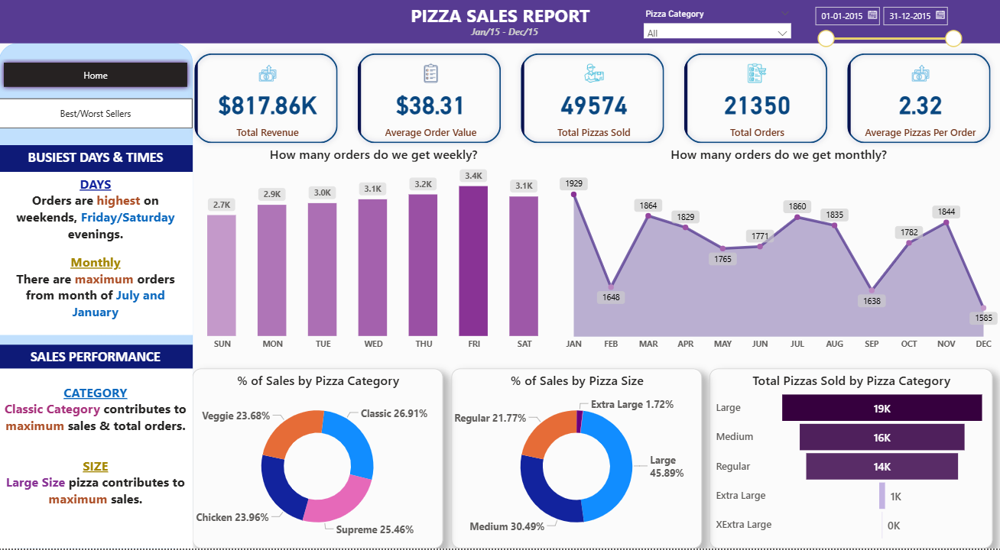
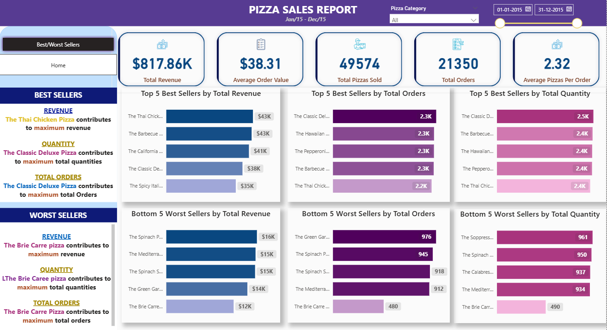

# 🍕 Pizza Sales Analysis

## 📊 Project Overview
This project involves a detailed analysis of pizza sales data to uncover key business insights using **SQL** for data aggregation and **Power BI** for interactive visualisation. The goal is to evaluate sales performance, identify product trends, and understand customer behaviour to support strategic business decisions.

### 🧠 Objectives
* Calculate core Key Performance Indicators (**KPIs**): Total Revenue, Total Orders, Total Pizzas Sold, Average Order Value (AOV), and Average Pizzas per Order.
* Identify the **best and worst performing pizzas** by revenue and orders.
* Analyze sales distribution by **pizza category and size**.
* Evaluate **weekly and monthly order trends** to identify peak and dip periods.

---

## 🗂️ Dataset Information
| Column Name | Description |
| :--- | :--- |
| `order_id` | Unique identifier for each order |
| `pizza_name_id` | Unique pizza identifier |
| `quantity` | Number of pizzas ordered |
| `order_date` | Date of order |
| `order_time` | Time of order |
| `unit_price` | Price per pizza |
| `total_price` | Total order value |
| `pizza_category` | Type of pizza (Classic, Supreme, Veggie, etc.) |
| `pizza_size` | Size of pizza (S, M, L, XL, XXL) |
| `pizza_name` | Full name of the pizza |

* **File:** `pizza_sales.csv`
* **Total Rows:** ~4,800

---

## 🧮 SQL Analysis
The analysis utilises SQL for data extraction and aggregation, forming the foundation for the Power BI dashboard. All queries are contained within the [`pizza_sales.sql`](pizza_sales.sql) file.

### Key Analytical Queries
#### 1. Sales KPIs
* **Total Revenue:** `SELECT SUM(total_price) AS Total_Revenue FROM pizza_sales;`
* **Total Orders:** `SELECT COUNT(DISTINCT order_id) AS Total_Orders FROM pizza_sales;`
* **Average Order Value (AOV):** `SELECT SUM(total_price) / COUNT(DISTINCT order_id) AS Avg_Order_Value FROM pizza_sales;`

#### 2. Trend Analysis
* **Weekly Trend:** Orders grouped by `order_day` to find peak sales days.
* **Monthly Trend:** Orders grouped by `order_month` to analyze seasonal or monthly performance.

#### 3. Distribution Analysis
* **% of Sales by Pizza Category:** Calculation of the revenue share for each pizza category.
* **% of Sales by Pizza Size:** Calculation of the revenue share for each pizza size.

#### 4. Top & Bottom Performers
* **Top 5 Best/Worst Sellers:** Identification of the pizzas driving the most (or least) revenue and total orders.

---

## 📈 Power BI Dashboard
The insights from the SQL analysis are visualized in an interactive dashboard created with Power BI.

### Dashboard Sections
1.  **Overview Page:** Displays main KPIs and overall sales metrics.
2.  **Category Analysis:** Breakdown of sales by pizza type and size preference.
3.  **Top & Bottom Performers:** Highlights best and worst performing pizzas by revenue and orders.
4.  **Time Trends:** Detailed look at weekly and monthly order insights.

### 📍 Key Insights
A few actionable takeaways derived from the analysis:

* ✅ **Classic** pizzas contributed the highest share of total revenue, suggesting they are the core offering.
* ✅ **Large-sized** pizzas were the most preferred by customers, indicating a preference for value or group orders.
* ✅ **Friday and Saturday** recorded the highest sales volume, confirming peak weekend business.
* ✅ **Promotional opportunities** exist during mid-week sales dips (e.g., Tuesday-Thursday) to boost volume.

---

## ⚙️ Tools & Technologies
| Tool | Purpose |
| :--- | :--- |
| **SQL Server** | Data extraction, cleaning, and aggregation for analytical purposes. |
| **Power BI** | Data visualisation, dashboard creation, and interactive reporting. |
| **Excel / CSV** | Initial data cleaning and preprocessing. |

### 🧰 Skills Demonstrated
* Data Cleaning & Transformation
* SQL Aggregations, Grouping, and Query Optimisation
* Data Visualisation using Power BI
* KPI & Metric Calculation
* Analytical Thinking & Insight Derivation

---

## 💼 Project Files
| File Name | Description |
| :--- | :--- |
| `pizza_sales.csv` | The raw dataset used for the analysis. |
| `pizza_sales.sql` | All SQL analysis queries used to aggregate the data. |
| `pizza_sales_analysis.pbix` | The Power BI dashboard file for interactive visualization. |
| `README.md` | This project documentation. |

---

## 📬 Contact
**Author:** Megha Karn

📧 **karnmegha425@gmail.com**

🔗 **www.linkedin.com/in/meghakarn2001**

📂 **[GitHub](https://github.com/Megha-karn?tab=repositories)**

⭐ If you found this project helpful, consider giving it a star on GitHub! ⭐
